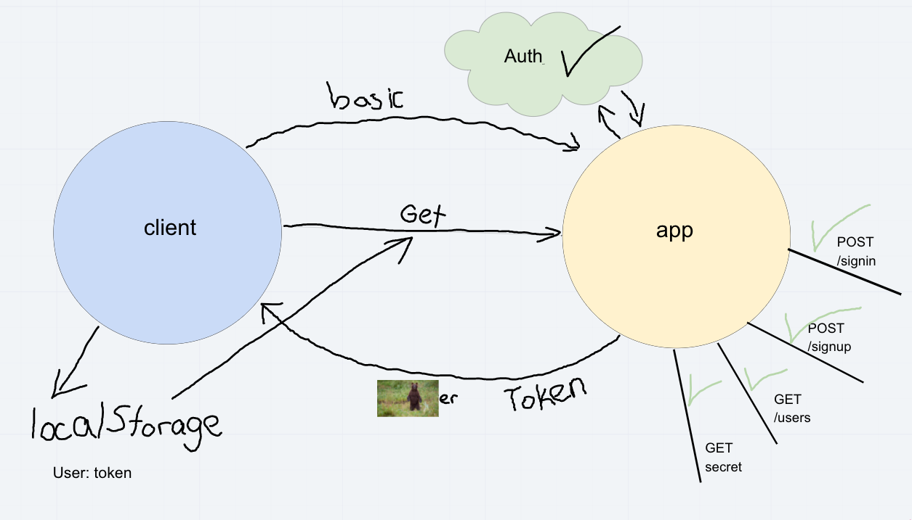

# LAB: Bearer Authentication

Authentication System Phase 2: Deploy an Express server that implements basic and bearer Authentication, with signup and signin capabilities, using a Mongo database. Any user that has successfully logged in using basic authentication (username and password) is able to continuously authenticate using a token.

## Author: Carly Dekock

## [Link to GitHub repository](https://github.com/carlydekock/bearer-auth.git)
## [Link to PR](https://github.com/carlydekock/bearer-auth/pull/2)

## Deployed links

- [Link to Heroku](https://carlydekock-bearer-auth.herokuapp.com/)
- [Link to GitHub actions](https://github.com/carlydekock/bearer-auth/actions)

## The Setup

### How to install

- Clone down repository from GitHub
- Run the command ```npm install``` to install dependencies (@code-fellows/supergoose, base-64, bcrypt, cors, dotenv, express, jest, jsonwebtoken, mongoose, morgan)
- create .env file with PORT variable, MONGODB_URI, and SECRET

### How to test

- Run the command ```npm test``` to test and verify the server is working

### How to run

- Start the server using ```nodemon```
- Visit http://localhost:PORT at the PORT number you've assigned in your .env

## UML


## Credits and Collaborations

- Worked at lab table with Jason Q, Jason D, Nick M, Seid, and Bill
